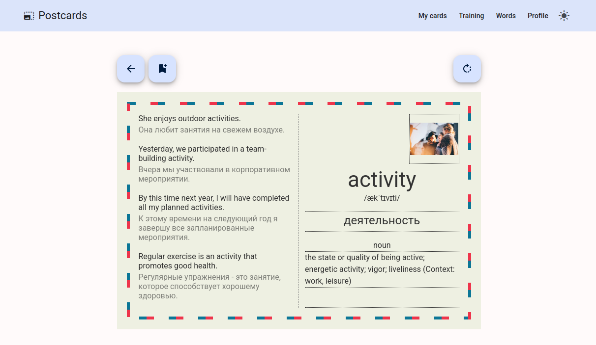

# Postcardify - English Learning Cards

[](https://github.com/ctrl-break/postcardify/blob/main/LICENSE)

## Overview

[https://postcardify.online/](https://postcardify.online/)

Postcardify is an English vocabulary learning app styled like postcards. It contains words with picture, categorized by language level and various usage examples.



Built as a Nx monorepo, it consists of:

-   **Frontend**: Angular 19 application with [future-sliced design](https://feature-sliced.design/) and MaterialUI
-   **Backend**: NestJS API with JWT authentication
-   **Database**: PostgreSQL with Prisma ORM
-   **Serverless**: AWS Lambda + DynamoDB for exercises

## Features

### Core Functionality

-   6000+ categorized words (A1-C1 levels)
-   Interactive vocabulary cards
-   Postcard images from [Unsplash](https://unsplash.com/)
-   Spaced repetition exercises (in progress)
-   Progress tracking (in progress)

### Technical Highlights

🔒 JWT Authentication  
📚 Swagger API documentation  
🚀 Auto-generated frontend services from OpenAPI spec  
📦 Dockerized infrastructure  
⚡ AWS Lambda integration for exercises

## Getting Started

### Prerequisites

-   Node.js v20+
-   Docker & Docker Compose
-   NPM 10+

### Installation

```bash
git clone https://github.com/ctrl-break/postcardify.git
cd postcardify
npm install

make init-db # Initialize containers and set env variables
```

## Development

### Running Services

```bash
# Start backend
make dev-api

# Start frontend (in separate terminal)
nx serve front
```

Access services at:

-   Frontend: http://localhost:4200
-   API : http://localhost:3000/api/v1

## Project Structure

```
postcardify/
├── apps/
│   ├── api/         # NestJS backend
│   └── front/       # Angular 19 frontend
└── db/              # Database scripts
```

## Scripts

### NPM Scripts

```json
{
    "format": "Format all TS/HTML/SCSS files",
    "format:words": "Format words generated by ChatGPT",
    "generate-api": "Generate frontend services from Swagger spec"
}
```

### Makefile Commands

| Command             | Description                              |
| ------------------- | ---------------------------------------- |
| `make deploy-api`   | Build & push API container with date tag |
| `make deploy-front` | Build & push frontend container          |
| `make build-api`    | Production build of API                  |
| `make stop`         | Stop all running containers              |

## Deployment

### Production Deployment

```bash
# Deploy both services
make deploy-api
make deploy-front

# Expected tag format: yymmddXX (e.g. 240715ab)
```

### Environment Variables

Ensure these are set in `.env`:

```ini
# Created by script
DATABASE_NAME=''
DATABASE_USER=''
DATABASE_PASS=''
DATABASE_PORT=''
DATABASE_URL=''
JWT_SECRET=''
# UNSPLASH integration
UNSPLASH_ACCESS_KEY='xxx-yyy-zzz'
```

## Documentation

### API Documentation

Access Swagger UI at `http://localhost:3000/swagger` when API is running.

### Frontend Architecture

-   Future-sliced design methodology
    
-   NGRX Signals state management
-   Auto-generated services from Swagger:

```typescript
// Example generated service usage
this.apiService.words.getWordDetails(id).subscribe(...);
```
